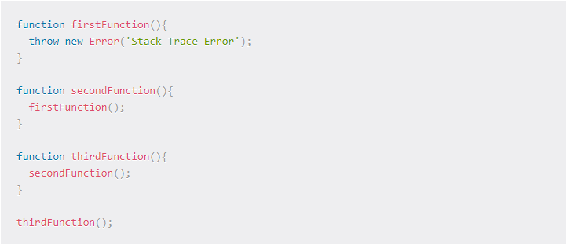

# Notes from Read: 09 Functional Programming
[Home](README.md)

Understanding the JavaScript Call Stack
What is a ‘call’?
a call is an invocation of a function or some sort of code.

How many ‘calls’ can happen at once?
as many as you wish.

What does LIFO mean?
last in first out

Draw an example of a call stack and the functions that would need to be invoked to generate that call stack.

What causes a Stack Overflow?

JavaScript error messages

What is a ‘refrence error’?
when you are referencing something that either does not exist or is declaired after it is used.

What is a ‘syntax error’?
this would come from something being typed incorrectly.

What is a ‘range error’?
manipulating somethings length that doesnt have a length or isnt an array/object.

What is a ‘tyep error’?
I honestly dont know.

What is a breakpoint?
its a spot where you end a process being done by the program/code like breaking a loop.

What does the word ‘debugger’ do in your code?
it shows you the history before that point.